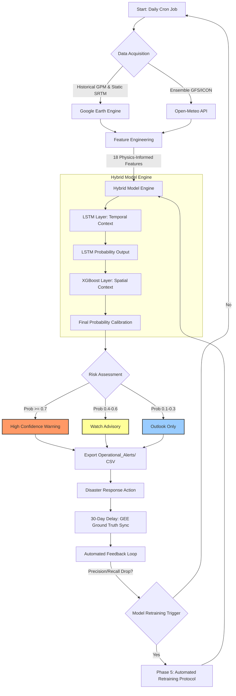
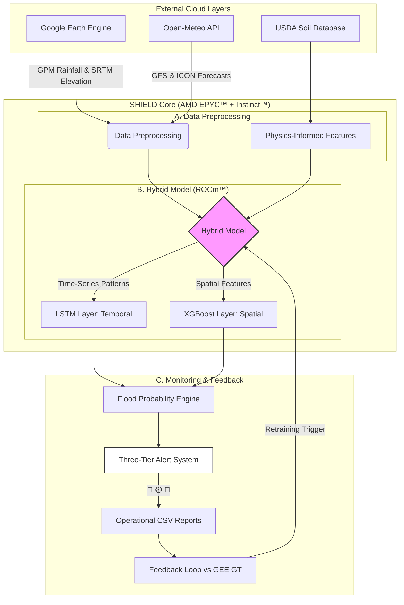
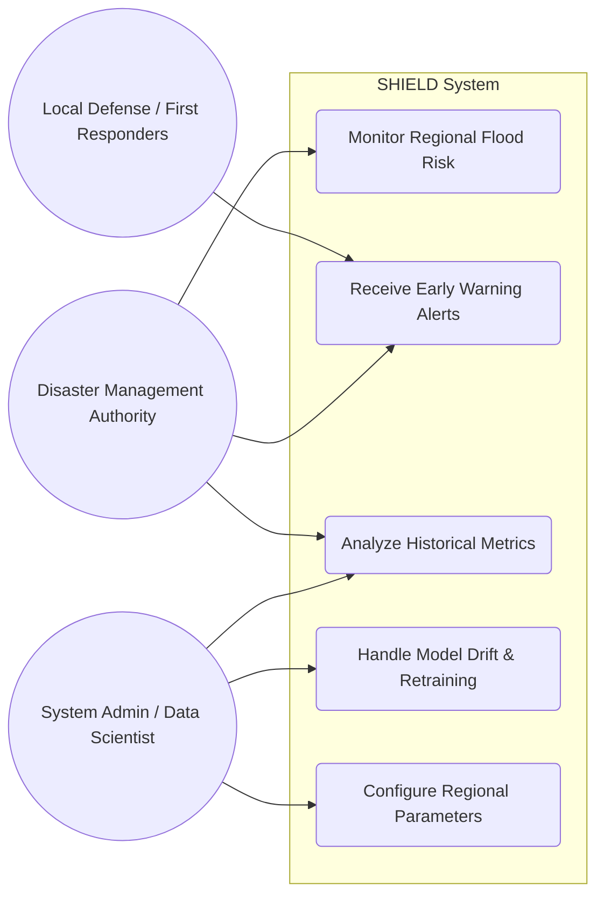
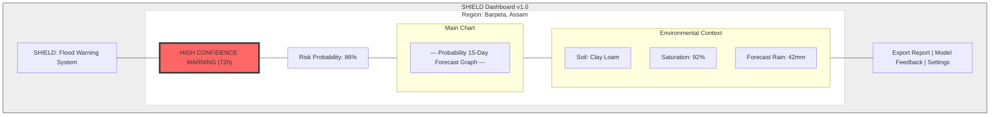

# SHIELD: System Diagrams & Architecture

This document provides a visual overview of the SHIELD (Scalable Hydrological Intelligence for Early flood-risk and Lead-time Detection) system, including its operational flow, user interactions, technical architecture, and UI design.

---

## 🔄 Process Flow Diagram
The operational lifecycle of SHIELD from data ingestion to automated feedback.

---

## 🏗️ System Architecture Diagram
Technical stack and data flow optimized for AMD hardware, merging high-level logic with system components.

---

## 👥 Use Case Diagram
Interaction between different stakeholders and the SHIELD system.

---

## 🎨 UI Wireframe Mockup
Proposed dashboard layout for the "High Confidence Warning" view.

