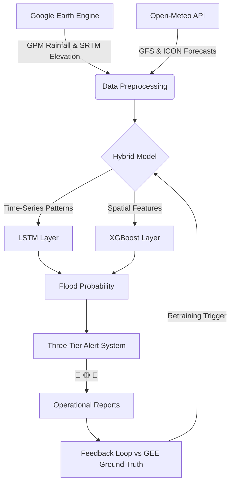

# SHIELD: Smart Hydro-climate Insights for Early warning & Local Defense

[](https://opensource.org/licenses/MIT)
[](https://www.python.org/downloads/)
[]()

**SHIELD** is an advanced AI-powered flood prediction and early warning system designed to bridge the gap between global climate data and local disaster preparedness. By combining high-resolution satellite imagery, real-time weather forecasts, and physics-informed environmental features, SHIELD provides actionable flood risk assessments up to **15 days in advance**.

---

## 🚀 Key Features

- **15-Day Rolling Forecast**: Daily updated flood probabilities for targeted regions.
- **Hybrid AI Architecture**: Combines **LSTM** (temporal patterns) with **XGBoost** (spatial terrain logic).
- **Three-Tier Alert System**:
    - 🔴 **High Confidence Warning (Day 1-3)**: Imminent risk, immediate action required.
    - 🟡 **Watch Advisory (Day 4-7)**: High likelihood pattern detected.
    - 🔵 **Outlook (Day 8-15)**: Statistical risk, monitor for developments.
- **Physics-Informed Features**: Calculates dynamic "Flood Thresholds" based on USDA soil texture, elevation (SRTM), and rainfall intensity.
- **Automated Feedback Loop**: Self-evaluates against Google Earth Engine (GEE) ground truth to detect and signal model drift.

---

## 📊 Performance Metrics

SHIELD is rigorously evaluated using a rolling 15-day simulation (simulating a daily cron job).

| Lead Time | Precision | Recall | F1 Score | Status |
|---|---|---|---|---|
| **1-Day** | 38.1% | 45.7% | **0.416** | 🔴 Warning |
| **3-Day** | 31.8% | 22.6% | **0.264** | 🟡 Watch |
| **5-Day** | 50.0% | 29.6% | **0.372** | 🟡 Watch |
| **7-Day** | 50.0% | 39.1% | **0.439** | 🟡 Watch |
| **10-Day** | 42.9% | 23.1% | **0.300** | 🔵 Outlook |

*Note: The system identifies a "Perfect Weather Ceiling" F1 of **0.704**, indicating high potential when forecasts are accurate.*

---

## 🏗️ System Architecture



---

## 🛠️ Technology Stack

- **Core**: Python 3.9+
- **Machine Learning**: TensorFlow (LSTM), XGBoost, Scikit-learn
- **Data APIs**: Google Earth Engine (GEE), Open-Meteo (Ensemble Forecasts)
- **Physics**: USDA Soil Texture Analysis, Antecedent Precipitation Index (API)
- **Hardware Acceleration**: Optimized for **AMD Instinct™ GPUs** (via ROCm™) and **AMD EPYC™** CPUs for high-throughput operational runs.

---

## 📅 Implementation Roadmap

### Phase 1: Foundation
- Multi-region data gathering using GEE.
- Initial XGBoost implementation for spatial classification.

### Phase 2: LSTM & Hybrid Integration
- Integration of LSTM to capture temporal rainfall dependencies.
- Hybrid probability calibration (XGBoost fitted on LSTM embeddings).

### Phase 3: Forecast Ensembling
- Transition from historical data to real-time ensembled weather forecasts (GFS/ICON).
- Calibration of per-lead-time thresholds.

### Phase 4: Operationalization
- Automated daily `cron` job pipeline.
- Three-tier alerting system and CSV export.

### Phase 5: Continuous Improvement
- Automated model drift detection.
- Proactive retraining protocol based on new labeled data accumulation.

---

## 📦 Setup & Usage

### Prerequisites
- Python 3.9+
- Google Earth Engine Service Account and Key
- Required packages: `pip install -r requirements.txt` (Coming soon)

### Running Daily Operations
```bash
python run_daily_operational.py
```

### Evaluating Performance
```bash
python evaluate_predictions.py --rolling-eval
```

---

## 📜 Acknowledgements
Developed as a robust early warning solution for flood-prone regions, leveraging modern AI to protect local communities.

---
*Created by [ALPHA-117](https://github.com/ALPHA-117)*
