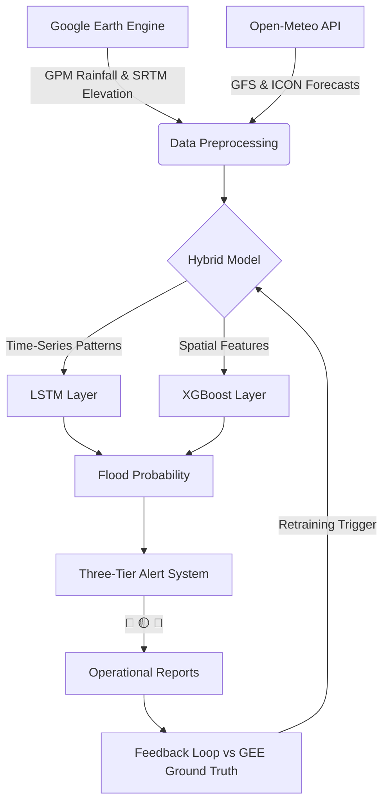

# SHIELD: Scalable Hydrological Intelligence for Early flood-risk and Lead-time Detection

[](https://opensource.org/licenses/MIT)
[](https://www.python.org/downloads/)
[]()
[]()

**SHIELD** is an advanced AI-powered flood prediction and early warning system designed to bridge the gap between global climate data and local disaster preparedness. By combining high-resolution satellite imagery, real-time weather forecasts, and physics-informed environmental features, SHIELD provides actionable flood risk assessments up to **15 days in advance**.

---

## 🚀 Key Features

- **15-Day Rolling Forecast**: Daily updated flood probabilities for targeted regions.
- **Hybrid AI Architecture**: Combines **LSTM** (temporal patterns) with **XGBoost** (spatial terrain logic).
- **Three-Tier Alert System**:
    - 🔴 **High Confidence Warning (Day 1-3)**: Imminent risk, immediate action required.
    - 🟡 **Watch Advisory (Day 4-7)**: High likelihood pattern detected.
    - 🔵 **Outlook (Day 8-15)**: Statistical risk, monitor for developments.
- **Physics-Informed Features**: Calculates dynamic "Flood Thresholds" based on USDA soil texture, elevation (SRTM), and rainfall intensity.
- **Automated Feedback Loop**: Self-evaluates against Google Earth Engine (GEE) ground truth to detect and signal model drift.

---

## 📊 Performance Metrics

SHIELD is rigorously evaluated using a rolling 15-day simulation (simulating a daily cron job).

| Lead Time | Precision | Recall | F1 Score | Status |
|---|---|---|---|---|
| **1-Day** | 38.1% | 45.7% | **0.416** | 🔴 Warning |
| **3-Day** | 31.8% | 22.6% | **0.264** | 🟡 Watch |
| **5-Day** | 50.0% | 29.6% | **0.372** | 🟡 Watch |
| **7-Day** | 50.0% | 39.1% | **0.439** | 🟡 Watch |
| **10-Day** | 42.9% | 23.1% | **0.300** | 🔵 Outlook |

> [!NOTE]  
> **Contextual Improvement**: Baseline F1 before improvements was **0.267 (1-day only)**. 5-day and 7-day lead times had **zero detection capability** at baseline.
> The **Perfect Weather Ceiling** of F1 **0.704** confirms the architecture's true potential — current scores are bottlenecked primarily by weather forecast quality, not model capability.

---

## 🏗️ System Architecture



---

## 🛠️ Technology Stack

- **Core**: Python 3.9+
- **Machine Learning**: TensorFlow (LSTM), XGBoost, Scikit-learn
- **Data APIs**: Google Earth Engine (GEE), Open-Meteo (Ensemble Forecasts)
- **Physics**: USDA Soil Texture Analysis, Antecedent Precipitation Index (API)
- **Hardware Acceleration**: Optimized for **AMD Instinct™ GPUs** (via ROCm™) and **AMD EPYC™** CPUs for high-throughput operational runs.

---

## 📅 Implementation Roadmap

### Phase 1: Threshold Calibration
- Bracket-level analysis (1–2, 3–4, 5–7, 8–15 days) to identify lead-time specific probability cutoffs.
- Dynamic integration into the `config.THRESHOLDS` pipeline to maximize recall.

### Phase 2: `is_forecast` Augmentation & Retraining
- Modified the data pipeline to understand the difference between historical ground-truth and API-derived forecasts.
- Injected augmented sequences during training to teach the model to handle "statistical noise" at longer horizons.

### Phase 3: GFS/ICON Ensemble Integration
- Replaced single-source weather fetching with a multi-model ensemble (GFS + ICON).
- Implemented a conservative blending logic (max rainfall for short-term, average for long-term).

### Phase 4: Operational Pipeline
- Developed `run_daily_operational.py` for automated daily monitoring.
- Integrated automated headless GEE data fallback for seamless context building.

### Phase 5: Continuous Improvement
- Established a monthly "Model Drift" detection protocol comparison against GEE ground-truth.
- Automated retraining triggers defined by sustained degradation in precision or recall.

---

## 📦 Setup & Usage

### Prerequisites
- Python 3.9+
- Google Earth Engine Service Account and Key
- Install dependencies: `pip install -r requirements.txt`

### Running Daily Operations
```bash
python run_daily_operational.py
```

### Evaluating Performance
```bash
python evaluate_predictions.py --rolling-eval
```

---

## 📜 Acknowledgements
- **Google Earth Engine** for satellite ground truth data
- **Open-Meteo** for GFS/ICON ensemble weather forecasts  
- **USDA** for soil texture classification data
- **AMD** for hardware acceleration support (ROCm™/Instinct™)

---
*Created by [ALPHA-117](https://github.com/ALPHA-117)*
